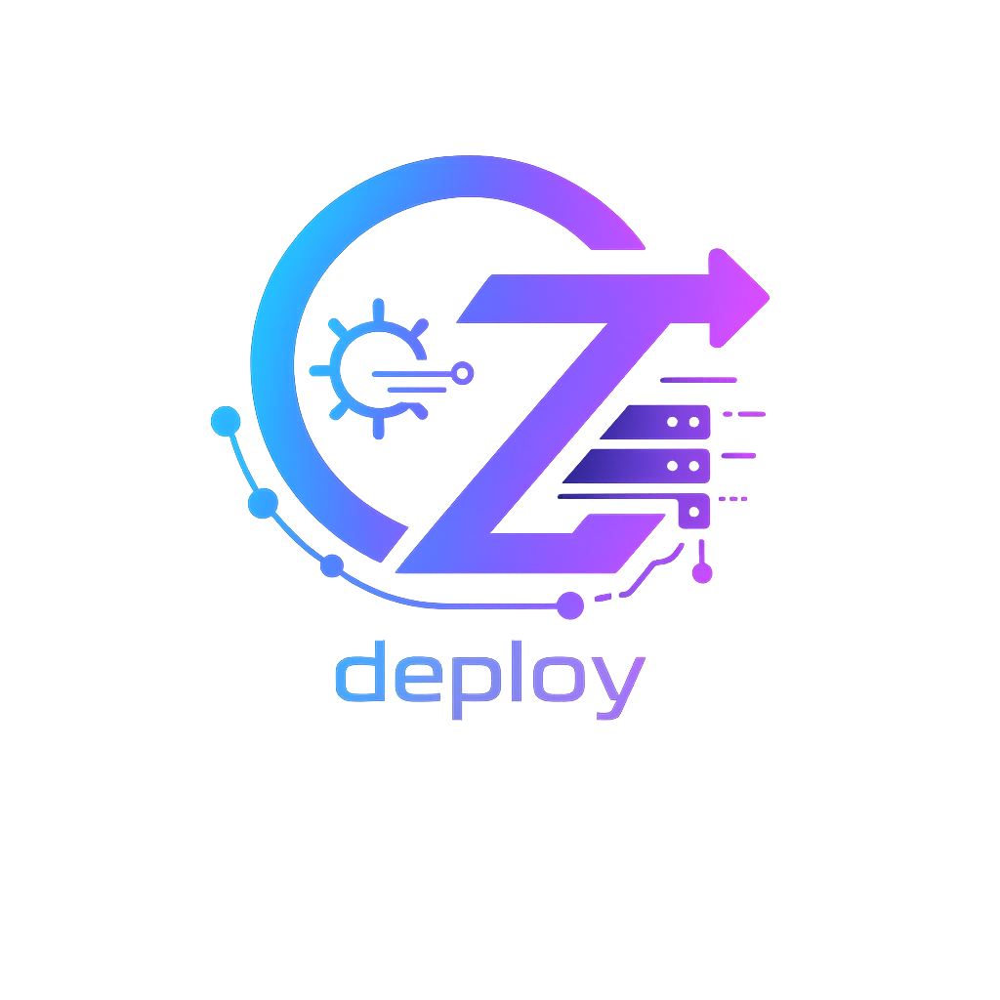

<a id="readme-top"></a>

<!-- PROJECT SHIELDS -->
<p align="center">
  <a href="https://github.com/OurNeZt/OurNeZt-deploy/actions/workflows/ci.yaml">
    
  </a>
  <a href="https://github.com/OurNeZt/OurNeZt-deploy/releases">
    
  </a>
  <a href="https://github.com/OurNeZt/OurNeZt-deploy/blob/stable/LICENSE">
    
  </a>
  <a href="https://github.com/OurNeZt/OurNeZt-deploy/pkgs/container/ournezt">
    
  </a>
</p>

<!-- PROJECT LOGO -->
<br />
<div align="center">
  <a href="https://github.com/OurNeZt/OurNeZt-deploy">
    
  </a>

  <p align="center">
    Deployment and runtime orchestration repository for the OurNeZt platform.
    <br />
    <br />
    <a href="https://github.com/OurNeZt/OurNeZt-deploy/issues/new?labels=bug&template=bug_report.md">Report Bug</a>
    &middot;
    <a href="https://github.com/OurNeZt/OurNeZt-deploy/issues/new?labels=enhancement&template=feature_request.md">Request Feature</a>
    &middot;
    <a href="https://github.com/OurNeZt/OurNeZt-deploy/releases">Releases</a>
  </p>
</div>

---

<!-- TABLE OF CONTENTS -->
<details>
  <summary>Table of Contents</summary>
  <ol>
    <li>
      <a href="#about-the-project">About The Project</a>
      <ul>
        <li><a href="#what-it-does">What It Does</a></li>
        <li><a href="#built-with">Built With</a></li>
      </ul>
    </li>
    <li>
      <a href="#getting-started">Getting Started</a>
      <ul>
        <li><a href="#prerequisites">Prerequisites</a></li>
        <li><a href="#installation">Installation</a></li>
        <li><a href="#configuration">Configuration</a></li>
      </ul>
    </li>
    <li><a href="#running-the-service">Running The Service</a></li>
    <li><a href="#testing">Testing</a></li>
    <li><a href="#docker">Docker</a></li>
    <li><a href="#release-flow">Release Flow</a></li>
    <li><a href="#roadmap">Roadmap</a></li>
    <li><a href="#contributing">Contributing</a></li>
    <li><a href="#license">License</a></li>
    <li><a href="#contact">Contact</a></li>
  </ol>
</details>

---

## About The Project

**OurNeZt Deploy** is the deployment and environment orchestration repository for the OurNeZt ecosystem.

It provides:

- Local multi-service orchestration with Docker Compose.
- Kubernetes deployment through a unified Helm chart (`charts/ournezt`).
- CI/CD workflows for deployment config validation, linting, and release packaging.

This repository is focused on infrastructure and deployment assets only.

<p align="right">(<a href="#readme-top">back to top</a>)</p>

---

## What It Does

OurNeZt Deploy currently provides:

- Local stack startup for `OurNeZt-web`, `OurNeZt-core`, and PostgreSQL.
- Shared environment variable patterns for local runtime.
- Stateful PostgreSQL deployment in Kubernetes.
- Core and web app deployment wiring with internal service discovery.
- Optional ingress configuration for web exposure.
- GitHub Actions workflows for compose validation, Helm lint/template checks, and chart release packaging.

---

## Built With

<p align="left">
  
  
  
  
  
  
</p>

<p align="right">(<a href="#readme-top">back to top</a>)</p>

---

## Getting Started

### Prerequisites

Install the following tools:

- Docker
- Docker Compose v2
- Helm 3
- kubectl (for Kubernetes deployments)

Optional but recommended:

- `make`

---

### Installation

Clone the repository:

```bash
git clone git@github.com:OurNeZt/OurNeZt-deploy.git
cd OurNeZt-deploy
```

Prepare local env:

```bash
cp .env.example .env
```

<p align="right">(<a href="#readme-top">back to top</a>)</p>

---

## Configuration

Configuration is handled through:

- `.env` for local Docker Compose runs.
- `values.yaml` / `values-*.yaml` for Helm deployments.

Local env example:

```bash
POSTGRES_DB=ournezt
POSTGRES_USER=ournezt
POSTGRES_PASSWORD=ournezt
POSTGRES_PORT=5432

CORE_APP_ENV=development
CORE_GRPC_PORT=50051
CORE_SESSION_TOKEN_BYTES=32
CORE_SESSION_TTL=24h
CORE_RUN_MIGRATIONS=true
CORE_BOOTSTRAP_ADMIN_EMAIL=admin@example.com
CORE_BOOTSTRAP_ADMIN_PASSWORD=P@ssw0rd
CORE_BOOTSTRAP_ADMIN_DISPLAY_NAME=Admin

WEB_APP_ENV=development
WEB_PORT=8080
WEB_SESSION_COOKIE_NAME=ournezt_session
WEB_SESSION_COOKIE_MAX_AGE=24h
WEB_SESSION_COOKIE_SECURE=false
WEB_REQUEST_TIMEOUT=5s
```

For production, prefer Kubernetes Secrets instead of inline passwords in Helm values.

---

## Running The Service

Run the full local stack:

```bash
docker compose up -d --build
```

Check logs:

```bash
docker compose logs -f postgres core web
```

Access:

- Web: `http://localhost:8080`
- Core gRPC: `localhost:50051`
- PostgreSQL: `localhost:5432`

Deploy to Kubernetes:

```bash
helm upgrade --install ournezt ./charts/ournezt \
  --namespace ournezt \
  --create-namespace \
  -f values-prod.yaml
```

<p align="right">(<a href="#readme-top">back to top</a>)</p>

---

## Testing

Validate compose config:

```bash
docker compose --env-file .env.example -f docker-compose.yml config
```

Lint and render Helm chart:

```bash
helm lint ./charts/ournezt
helm template ournezt ./charts/ournezt > /dev/null
```

Run GitHub workflow lint checks locally (optional):

```bash
yamllint .github/workflows docker-compose.yml charts/ournezt/Chart.yaml charts/ournezt/values.yaml
```

<p align="right">(<a href="#readme-top">back to top</a>)</p>

---

## Docker

Start:

```bash
docker compose up -d --build
```

Stop:

```bash
docker compose down
```

Reset volumes (destructive):

```bash
docker compose down -v
```

<p align="right">(<a href="#readme-top">back to top</a>)</p>

---

## Release Flow

This repository uses a controlled release flow:

```text
dev -> release/vX.Y.Z -> stable
```

The release process is:

1. Run the `prepare-release` workflow manually.
2. Select the version bump type: `patch`, `minor`, or `major`.
3. The workflow creates a `release/vX.Y.Z` branch and updates `CHANGELOG.md`.
4. Review and update the generated changelog entry.
5. Merge the release PR into `stable`.
6. The `release` workflow creates the Git tag, GitHub Release, and packaged Helm chart artifact.

<p align="right">(<a href="#readme-top">back to top</a>)</p>

---

## Roadmap

- [x] Unified Helm chart for web, core, and PostgreSQL
- [x] Local docker compose stack for web, core, and PostgreSQL
- [x] CI validation for compose and Helm rendering
- [x] Release workflow for Helm packaging
- [ ] Environment overlays (`values-dev.yaml`, `values-staging.yaml`, `values-prod.yaml`)
- [ ] Optional migration Job/Hook strategy for Kubernetes
- [ ] Secret manager integration patterns (external-secrets / sealed-secrets)
- [ ] Observability deployment add-ons (metrics, dashboards, alerts)

See the [open issues](https://github.com/OurNeZt/OurNeZt-deploy/issues) for planned improvements and known issues.

<p align="right">(<a href="#readme-top">back to top</a>)</p>

---

## Contributing

Contributions are welcome.

For normal development:

1. Create a feature branch from `dev`.

   ```bash
   git checkout dev
   git pull
   git checkout -b feature/your-feature-name
   ```

2. Make your changes.

3. Run validations.

   ```bash
   docker compose --env-file .env.example -f docker-compose.yml config
   helm lint ./charts/ournezt
   helm template ournezt ./charts/ournezt > /dev/null
   ```

4. Commit using conventional commit style.

   ```bash
   git commit -m "feat: add deployment capability"
   ```

5. Open a pull request into `dev`.

For release preparation, use the release workflow instead of manually creating tags.

<p align="right">(<a href="#readme-top">back to top</a>)</p>

---

## License

Distributed under the Apache License 2.0. See `LICENSE` for more information.

<p align="right">(<a href="#readme-top">back to top</a>)</p>

---

## Contact

Project Organisation: [OurNeZt](https://github.com/OurNeZt)

Repository: [https://github.com/OurNeZt/OurNeZt-deploy](https://github.com/OurNeZt/OurNeZt-deploy)

<p align="right">(<a href="#readme-top">back to top</a>)</p>
